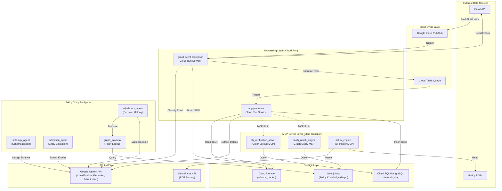
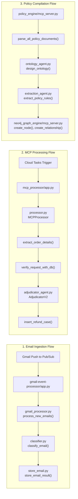
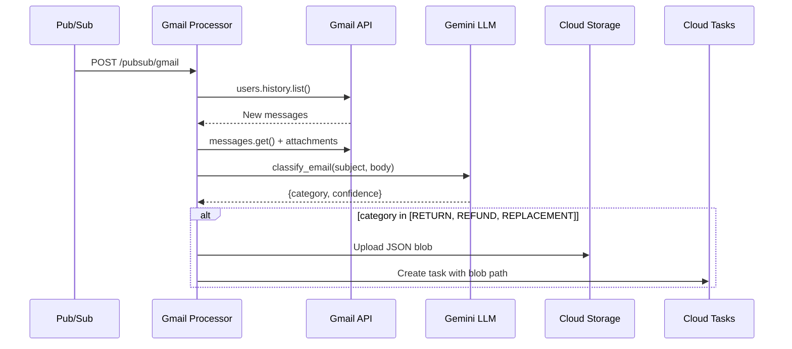
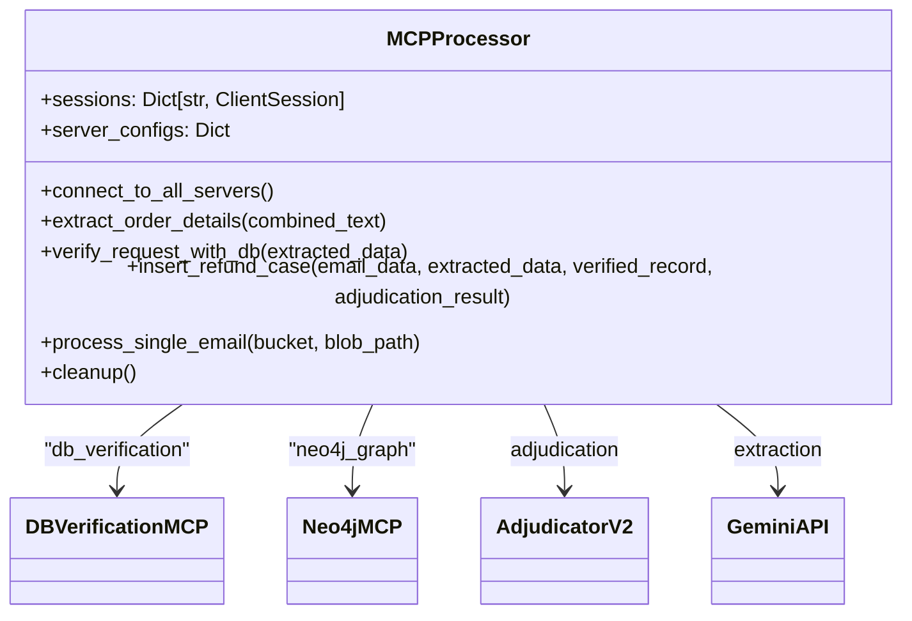
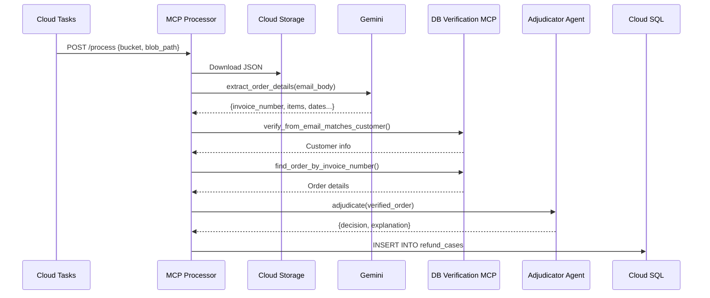
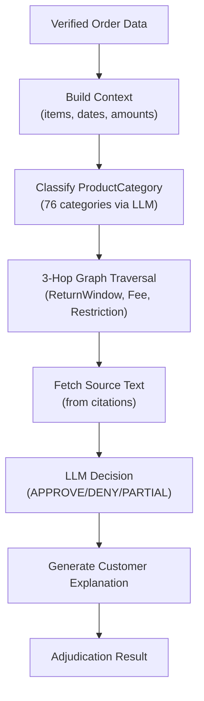
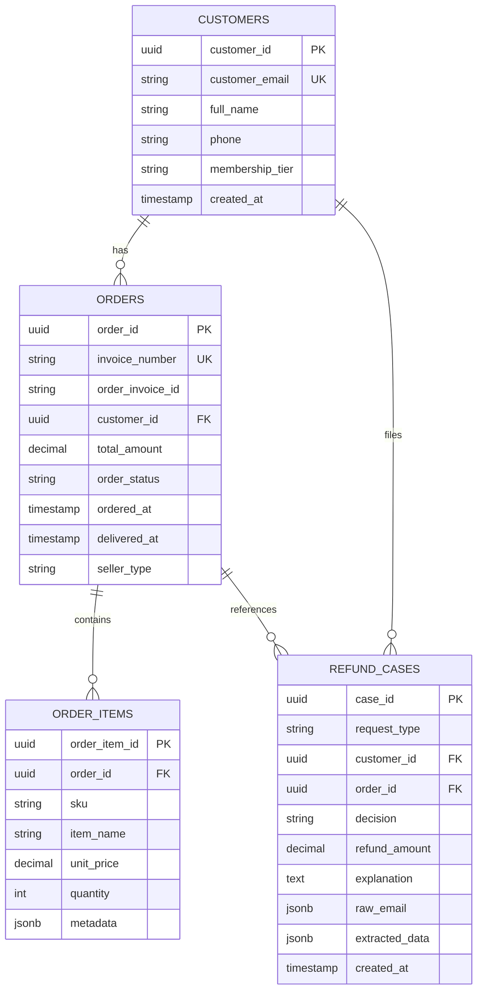
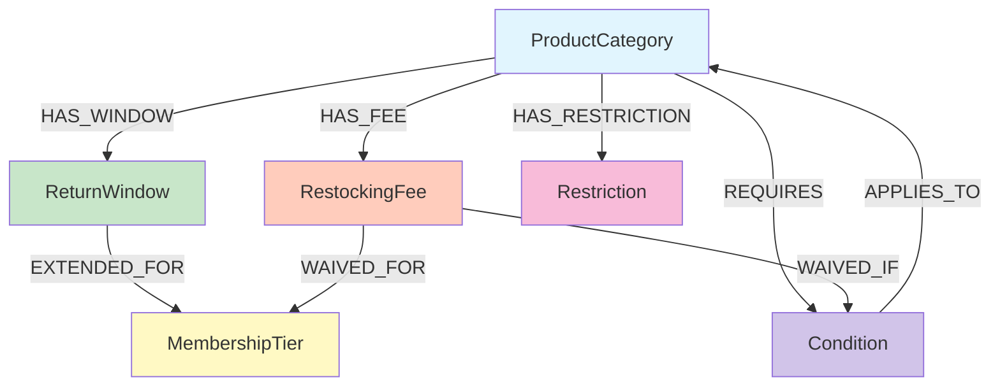
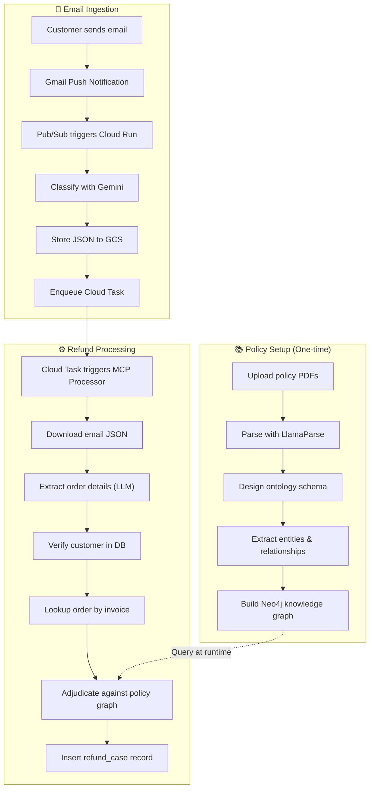

# High-Level Design (HLD) - MCP Customer Support System

## Executive Overview

This application is an **AI-powered Customer Support Automation System** that processes customer refund/return requests via email, verifies them against order databases, adjudicates requests using a policy knowledge graph, and stores decisions for downstream processing.

---

## System Architecture Diagram

---

## Detailed Component Diagram

---

## Component Descriptions

### 1. Gmail Event Processor (`gmail-event-processor/`)

| File | Purpose |
|------|---------|
| [app.py](file:///c:/Users/satis/projects/mcp-customer-support/gmail-event-processor/app.py) | FastAPI endpoint `/pubsub/gmail` triggered by Pub/Sub |
| [gmail_processor.py](file:///c:/Users/satis/projects/mcp-customer-support/gmail-event-processor/gmail_processor.py) | Reads Gmail via History API, extracts body/attachments |
| [classifier.py](file:///c:/Users/satis/projects/mcp-customer-support/gmail-event-processor/classifier.py) | LLM-based email classification (RETURN/REFUND/REPLACEMENT/NONE) |
| [store_email.py](file:///c:/Users/satis/projects/mcp-customer-support/gmail-event-processor/store_email.py) | Stores JSON to GCS, enqueues Cloud Task |
| [secret_manager.py](file:///c:/Users/satis/projects/mcp-customer-support/gmail-event-processor/secret_manager.py) | Loads Gmail tokens and Gemini API key from Secret Manager |
| [history_store.py](file:///c:/Users/satis/projects/mcp-customer-support/gmail-event-processor/history_store.py) | Tracks Gmail historyId using Secret Manager |

**Data Flow:**

---

### 2. MCP Processor (`mcp_processor/`)

| File | Purpose |
|------|---------|
| [app.py](file:///c:/Users/satis/projects/mcp-customer-support/mcp_processor/app.py) | FastAPI endpoint `/process` triggered by Cloud Tasks |
| [processor.py](file:///c:/Users/satis/projects/mcp-customer-support/mcp_processor/processor.py) | Core `MCPProcessor` class orchestrating the refund workflow |

**Key Class: `MCPProcessor`**

**Processing Flow:**

---

### 3. MCP Servers

#### 3.1 DB Verification Server (`db_verification/`)

| File | Purpose |
|------|---------|
| [db_verification_server.py](file:///c:/Users/satis/projects/mcp-customer-support/db_verification/db_verification_server.py) | MCP server exposing order lookup tools |
| [db.py](file:///c:/Users/satis/projects/mcp-customer-support/db_verification/db.py) | Cloud SQL connector using pg8000 |

**Exposed MCP Tools:**
| Tool | Description |
|------|-------------|
| `list_orders_by_customer_email` | Fetch order history for an email |
| `find_order_by_invoice_number` | Lookup single order with full hierarchy |
| `find_order_by_order_invoice_id` | Alternative lookup by order_invoice_id |
| `list_order_items_by_order_invoice_id` | Get line items for an order |
| `verify_from_email_matches_customer` | Check if email exists in customers table |
| `get_customer_orders_with_items` | Deep fetch with order items |
| `select_order_id` | LLM-assisted order matching |
| `llm_find_orders` | Generate SQL from natural language |

---

#### 3.2 Neo4j Graph Engine (`neo4j_graph_engine/`)

| File | Purpose |
|------|---------|
| [mcp_server.py](file:///c:/Users/satis/projects/mcp-customer-support/neo4j_graph_engine/mcp_server.py) | MCP server for Neo4j knowledge graph operations |
| [db.py](file:///c:/Users/satis/projects/mcp-customer-support/neo4j_graph_engine/db.py) | Neo4j async driver singleton |

**Exposed MCP Tools:**
| Tool | Description |
|------|-------------|
| `check_neo4j_connection` | Test database connectivity |
| `get_graph_schema` | Retrieve node labels and relationships |
| `get_graph_statistics` | Node/relationship counts |
| `execute_cypher_query` | Run read-only Cypher |
| `execute_cypher_write` | Run write Cypher (CREATE, MERGE) |
| `execute_cypher_batch` | Bulk graph construction |
| `create_node` | Create/merge a node |
| `create_relationship` | Create relationship between nodes |
| `create_schema_constraints` | Set up indexes |
| `clear_graph` | Delete all data (destructive) |
| `validate_graph_integrity` | Check for missing citations, orphans |
| `sample_graph_data` | Get sample nodes for verification |

---

#### 3.3 Policy Engine (`policy_engine/`)

| File | Purpose |
|------|---------|
| [mcp_server.py](file:///c:/Users/satis/projects/mcp-customer-support/policy_engine/mcp_server.py) | MCP server for PDF policy parsing |

**Exposed MCP Tools:**
| Tool | Description |
|------|-------------|
| `parse_all_policy_documents` | Parse all PDFs in a directory to combined Markdown |
| `parse_single_policy_document` | Parse a single PDF |

---

### 4. Policy Compiler Agents (`policy_compiler_agents/`)

These agents transform policy PDFs into a queryable Neo4j knowledge graph.

```mermaid
flowchart LR
    PDF["Policy PDFs"] --> Parse["LlamaParse"]
    Parse --> MD["Combined Markdown"]
    MD --> OA["Ontology Agent"]
    OA --> Schema["Graph Schema"]
    Schema --> EA["Extraction Agent"]
    EA --> Entities["Entities + Relationships"]
    Entities --> CG["Cypher Generator"]
    CG --> Neo4j["Neo4j Knowledge Graph"]
```

| Agent | File | Purpose |
|-------|------|---------|
| **Ontology Agent** | [ontology_agent.py](file:///c:/Users/satis/projects/mcp-customer-support/policy_compiler_agents/ontology_agent.py) | Designs graph schema (node labels, properties, relationships) using Gemini Thinking Mode |
| **Extraction Agent** | [extraction_agent.py](file:///c:/Users/satis/projects/mcp-customer-support/policy_compiler_agents/extraction_agent.py) | 3-phase pipeline: Triplet Extraction → Graph Linking → Cypher Generation |
| **Adjudicator Agent** | [adjudicator_agent.py](file:///c:/Users/satis/projects/mcp-customer-support/policy_compiler_agents/adjudicator_agent.py) | Makes refund decisions by traversing policy graph and applying LLM reasoning |
| **Graph Traversal** | [graph_traversal.py](file:///c:/Users/satis/projects/mcp-customer-support/policy_compiler_agents/graph_traversal.py) | 3-hop graph traversal from ProductCategory nodes |

**Adjudicator Flow:**

---

### 5. Database Schema

---

### 6. Knowledge Graph Schema

---

### 7. Infrastructure & Deployment

| Component | Deployment Target | Config File |
|-----------|-------------------|-------------|
| Gmail Processor | Cloud Run | [cloudbuild.yaml](file:///c:/Users/satis/projects/mcp-customer-support/cloudbuild.yaml) |
| MCP Processor | Cloud Run | [cloudbuild_mcp_processor.yaml](file:///c:/Users/satis/projects/mcp-customer-support/cloudbuild_mcp_processor.yaml) |
| Cloud Tasks Queue | Cloud Tasks | [create_queue.sh](file:///c:/Users/satis/projects/mcp-customer-support/infrastructure/create_queue.sh) |
| Master Deploy | Shell Script | [deploy.sh](file:///c:/Users/satis/projects/mcp-customer-support/infrastructure/deploy.sh) |

**Environment Variables:**

| Service | Key Variables |
|---------|---------------|
| Gmail Processor | `MCP_QUEUE_NAME`, `MCP_PROCESSOR_URL` |
| MCP Processor | `GEMINI_API_KEY`, `CLOUD_INSTANCE`, `CLOUD_DB_*`, `NEO4J_*`, `GCS_BUCKET_NAME` |

---

## Data Flow Summary

---

## Key Technologies

| Category | Technology |
|----------|------------|
| **Cloud Platform** | Google Cloud Platform (Cloud Run, Cloud Tasks, Pub/Sub, Cloud SQL, Secret Manager, Cloud Build) |
| **LLM/AI** | Google Gemini (gemini-2.0-flash, gemini-3-pro-preview) |
| **Graph Database** | Neo4j Aura |
| **PDF Parsing** | LlamaParse |
| **MCP Framework** | FastMCP (Model Context Protocol) |
| **Web Framework** | FastAPI + Uvicorn |
| **Container** | Docker |

---

## File Reference Index

| Category | Files |
|----------|-------|
| **Gmail Processing** | `gmail-event-processor/app.py`, `gmail_processor.py`, `classifier.py`, `store_email.py` |
| **MCP Processing** | `mcp_processor/app.py`, `processor.py` |
| **MCP Servers** | `db_verification/db_verification_server.py`, `neo4j_graph_engine/mcp_server.py`, `policy_engine/mcp_server.py` |
| **Policy Agents** | `policy_compiler_agents/ontology_agent.py`, `extraction_agent.py`, `adjudicator_agent.py`, `graph_traversal.py` |
| **Database** | `db_verification/db.py`, `neo4j_graph_engine/db.py` |
| **Infrastructure** | `cloudbuild.yaml`, `cloudbuild_mcp_processor.yaml`, `infrastructure/deploy.sh` |
| **Standalone/Dev** | `mcp_client/client.py`, `check_email_llm.py` |
